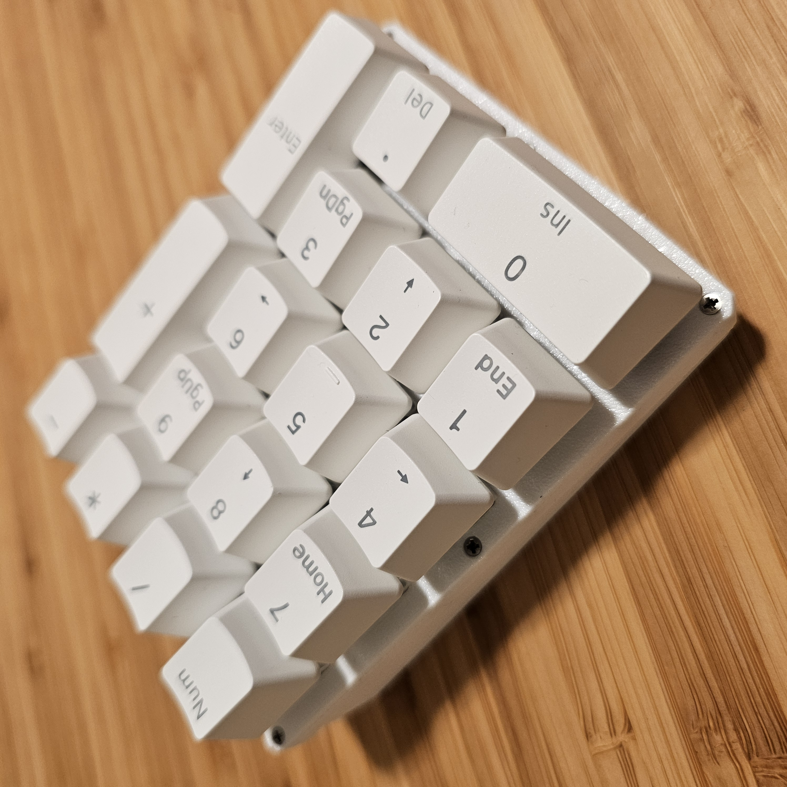
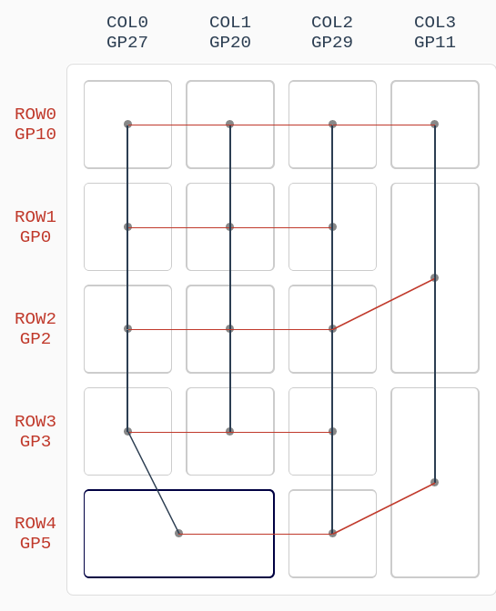
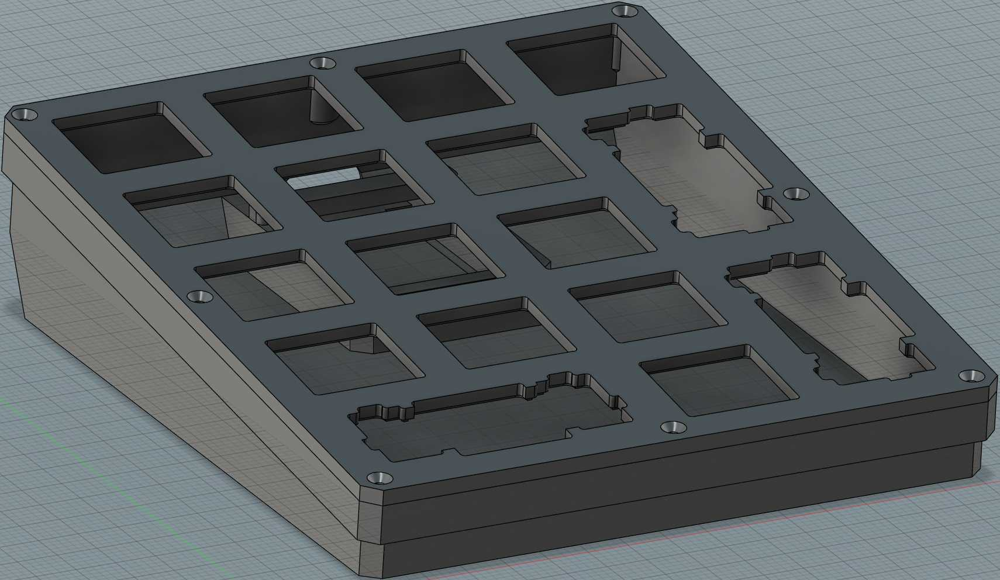

# Handwired Macropad



A quick handwired macropad I built for a coworker so that he could sample Box Jade switches.

## Bill of materials
* 17 Cherry style, plate-mounted switches, for example [Kailh Box Jades](https://www.amazon.com/gp/product/B0CBPRMP27/).

* 17 numpad keycaps salvaged from [el cheapo keycaps set](https://www.amazon.com/gp/product/B08K7FVZ5C/).

* 17 [1N4148 diodes](https://www.amazon.com/gp/product/B09PGJ1F9L/)

* 3 2u plate mounted [el cheapo stabilizers](https://www.amazon.com/gp/product/B096JQF1HH/).

* 8 M1.6 x 5mm self tapping, [flat-headed screws](https://www.mcmaster.com/90485A411/).

* 1 [Generic Pro micro RP2040 board]((https://www.aliexpress.us/item/3256805943704472.html)) or really any RP2040 based board, just be sure to use the same pins or edit the info.json file to match the ones you'll be using.

* Solder, wires and soldering iron.

## Pinout
* col0: GP27
* col1: GP20
* col2: GP29
* col3: GP11
* row0: GP10
* row1: GP0
* row2: GP2, the `+`  key is wired to the end of this row.
* row3: GP3
* row4: GP5, the `INTRO` key is wired to the end of this row.



Diodes are hooked into the rows, but if you solder them to the columns, remember to change the `diode_direction` to `ROW2COL` in the `info.json` file.

## Firmware installation

* After [setting up your QMK environment](https://docs.qmk.fm/#/getting_started_build_tools), copy the `handwired_macropad` folder into the `keyboards` directory of your QMK installation.

* To check the layout, run:

```
qmk info -kb handwired_macropad -l 
```

Then to compile and flash in one go, just enter bootloader mode on your RP2040 and run:

```
qmk flash -kb handwired_macropad -km default
```

If you're new to QMK, check out their [Complete Newbs Guide](https://docs.qmk.fm/#/newbs).

## 3d printed case


A case model is provided for you to 3d print. It is recommended to print the plate with the top side facing the print surface for texture transfer, while supports are recommended for the case body.